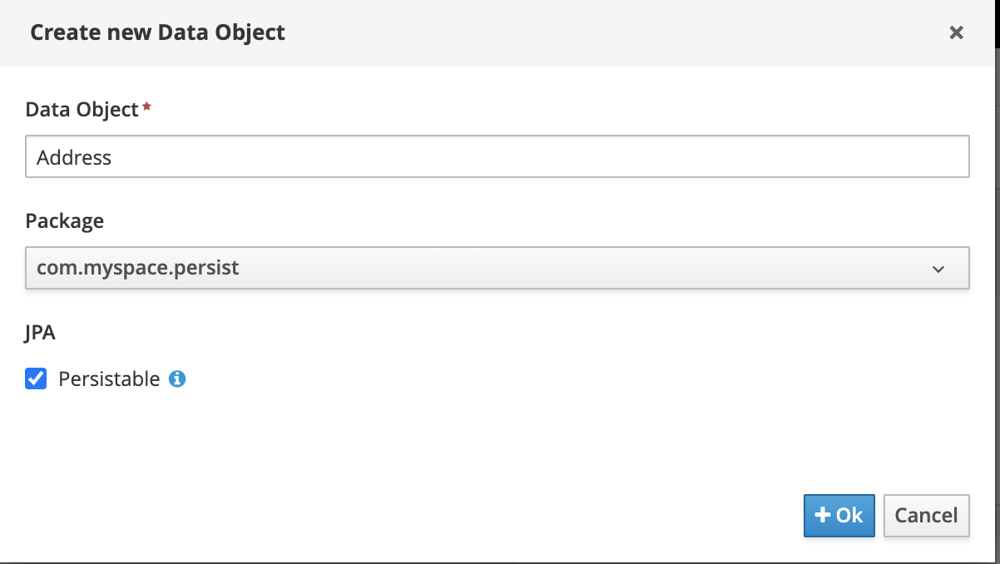
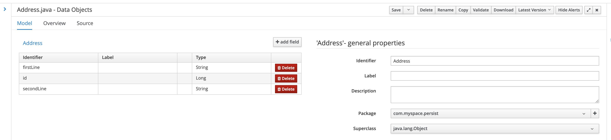
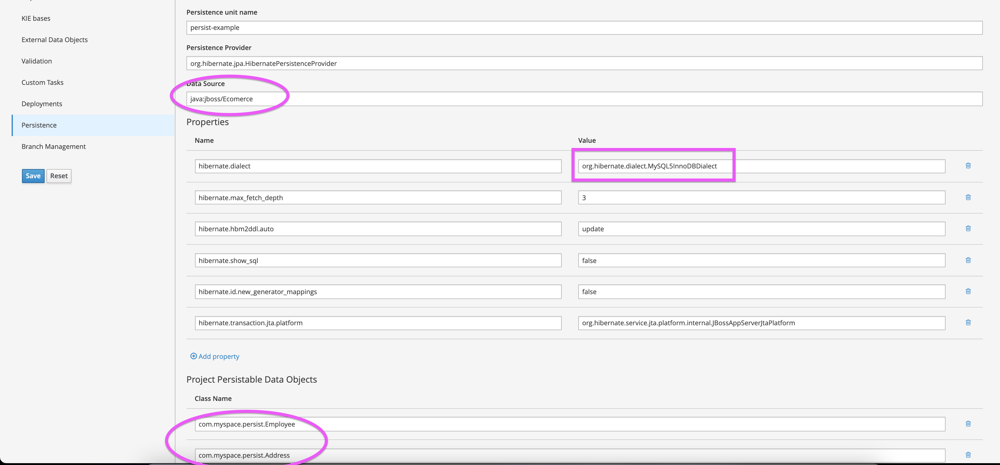
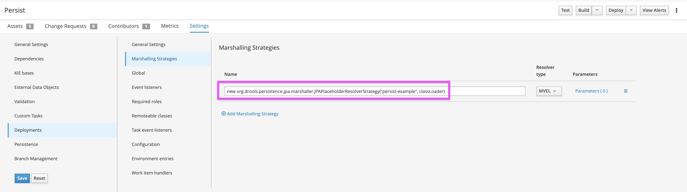
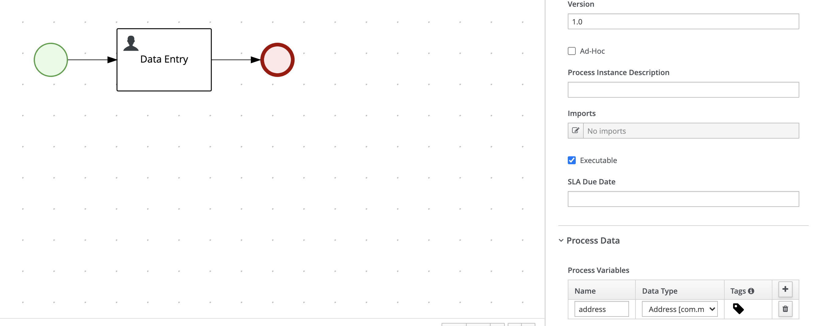
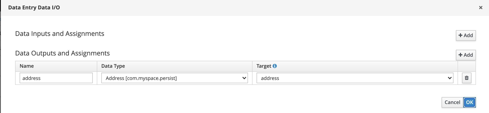
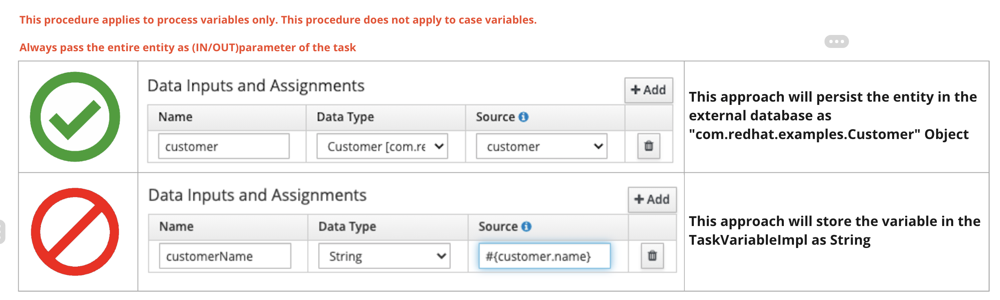

Introduction
=============
This project will demonstrate, persistence of process variable.

Generally there are two kinds of requireemnts,
Requirement 1: Persisting process variables in a separate database schema in Red Hat Process Automation Manager.
Requirement 2: Persisting process variables in a Red Hat Process Automation Manager database (Along with RHPAM tables).

In this example we are covering requirement 1.

Versions
========
EAP: JBOSS 7.3.6

RHPAM: 7.9.1

Step 1: Create a new Datasource
===============================
Refer to the official documentation to [create a new Datasource](https://access.redhat.com/documentation/en-us/red_hat_jboss_enterprise_application_platform/7.3/html/configuration_guide/datasource_management)   
Example(mysql):

```
<xa-datasource jndi-name="java:jboss/Ecomerce" pool-name="Ecomerce" enabled="true" use-java-context="true" use-ccm="true">
  <xa-datasource-property name="ServerName">localhost</xa-datasource-property>
  <xa-datasource-property name="DatabaseName">Ecomerce</xa-datasource-property>
  <driver>mysql</driver>
  <security>
    <user-name>USER_NAME</user-name>
    <password>XXXXX</password>
  </security>
  <validation>
    <valid-connection-checker class-name="org.jboss.jca.adapters.jdbc.extensions.mysql.MySQLValidConnectionChecker"/>
    <validate-on-match>true</validate-on-match>
    <background-validation>false</background-validation>
    <exception-sorter class-name="org.jboss.jca.adapters.jdbc.extensions.mysql.MySQLExceptionSorter"/>
  </validation>
</xa-datasource>

```

Step 2: Create and configure a persistable variable
===================================================
a. Create a new Data Object and flag it as "Persistable"

b. Create the needed fields. Example:

c. Navigate to Project Settings > Persistence
d. Insert the jndi name of the datasource
e. Set the correct hibernate.dialect
f. In the "Project Persistable Data Objects" add the fully qualified name of the created Data Object.




Step 3: Use the variable in a process
=============================
a. Create a new process definition

b. Create a new process variable
c. Add an output variable to the Human Task

d. Save, Build and deploy

Step 4: Test the process
========================
a. Create a new instance of the process.
b. Claim, start and complete the human task.
c. Verify the variable instance has been saved on the external database.
d. Verify in PAM 7 database that in the table VariableInstanceLog the inserted data are not visible.

Point of attention (NOTE)
=========================



Official documentation:
=======================
[PAM 7.9 persist variable](https://access.redhat.com/documentation/en-us/red_hat_process_automation_manager/7.9/html-single/managing_red_hat_process_automation_manager_and_kie_server_settings/index#process-variables-persist-proc_execution-server)
[JBoss EAP 7.3 datasource](https://access.redhat.com/documentation/en-us/red_hat_jboss_enterprise_application_platform/7.3/html/configuration_guide/datasource_management)
[External Blog](https://karinavarela.me/2020/06/17/persisting-custom-data-configuring-external-persistence/)
